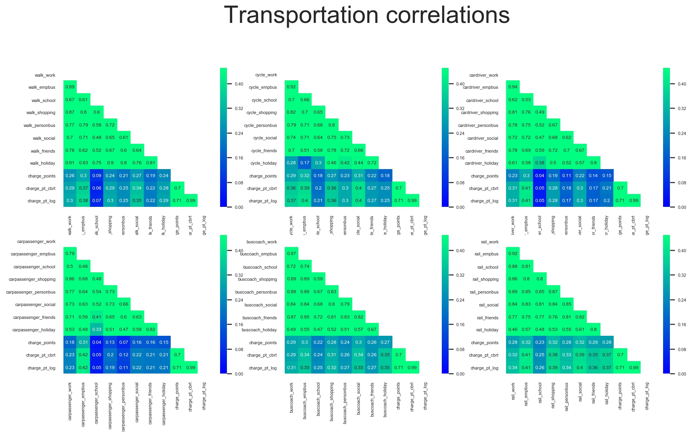
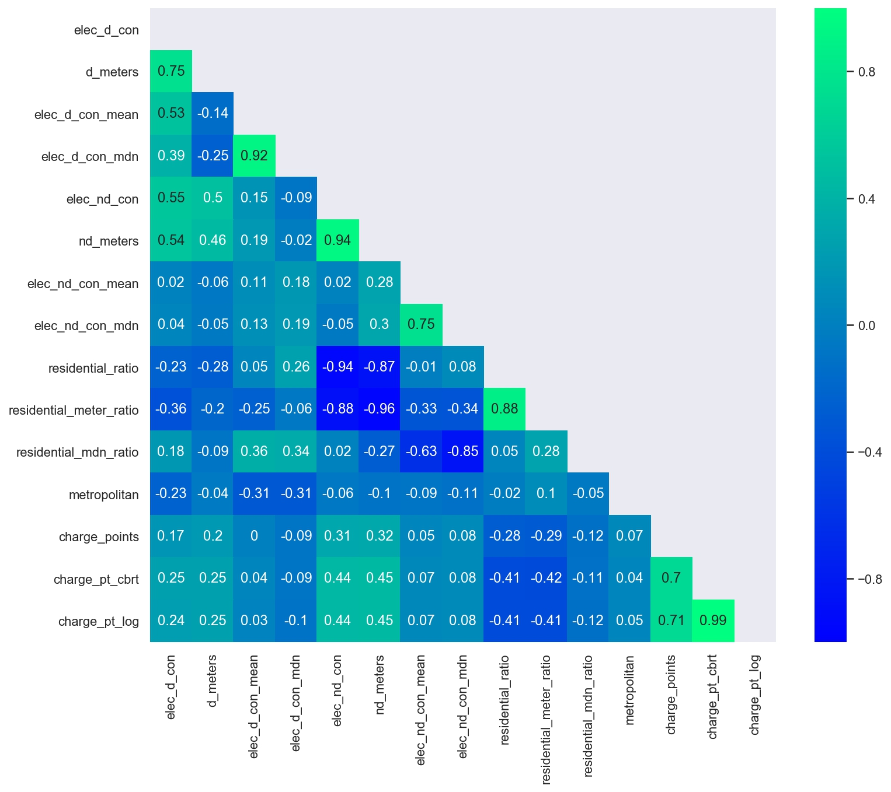

# Exploratory Data Analysis (EDA) - Feature Variables

###### Predicting Electric Vehicle Charge points locations in Britain

------

### Distributions

> ***It was found that most variables (features and target included) had skewed distributions.***
>
> The distribution of feature variables are mostly positively skewed with only 4.1% being normally distributed; Significant outliers in the variables exist

The variables that had *normal distributions* in the data across all MSOAs were:

***Socio-Economic*** 

| **variable**        | **description**                                              |
| :------------------ | :----------------------------------------------------------- |
| `chanyp_score`      | the lack of attainment and skills in the local population relating to children and young people |
| `adultskills_score` | the lack of attainment and skills in the local population relating to adult skills |
| `widerbar_score`    | barriers to housing and local services based on affordability |
| `geo_bar_scor`      | barriers to housing and local services based on physical proximity of local services |
| `indoor_score`      | the quality of the local environment based on quality of housing (indoors) |
| `outdoor_score`     | the quality of the local environment based on  air quality and road traffic accidents (outdoors) |
| `heatlh_score`      | the risk of premature death and the impairment of quality of life through poor physical or mental health |
| `crime_score`       | the risk of personal and material victimisation at local level |

<table>
    <tr>
        <td>
            
        </td>
        <td>
            
        </td>
    </tr>
</table>
________________________________
***Transport & Car related*** 

| **variable**             | **description**                                              |
| :----------------------- | :----------------------------------------------------------- |
| `cardriver_from_friends` | average weekday number of journeys done by driving from visit friends (home-based) |
| `two_car`                | number of people who own 2 cars in the MSOA                  |
| `total_cars`             | total number of cars in the MSOA                             |

<table>
    <tr>
        <td>
            
        </td>
        <td>
            
        </td>
    </tr>
</table>
------

### Transformations
> ***In order to address some of the outliers the data was transformed.*** This included logarithmic and power transformations (Box-Cox or Yeo-Johnson) to aggregation with final standardisation.

***Socio-Economic*** 

<table>
    <tr>
        <td>
            
         </td>
    </tr>
</table>

***Population & Income*** 
<table>
    <tr>
        <td>
            
        </td>
    </tr>
</table>

***Transportation*** 

<table>
    <tr>
        <td>
            
        </td>
    </tr>
</table>

***Electricity*** 
<table>
    <tr>
        <td>
            
        </td>
    </tr>
</table>

### Correlations

> ***EV charge points presence is somewhat correlated with non-domestic electricity consumption, weekday journeys to work, employers business or social events***

Large numbers of EV charge points in an area may occur where there is higher weekday number of journeys:

1. to employers business regardless of transportation mode in the respective area
2. to recreational events regardless of transportation mode in the respective area
3. to work by walking, cycling, driving or bus in the respective area
4. by rail to shopping in the respective area

Large numbers of EV charge points in an area may occur where there is:

1. high 2018 non-domestic electricity consumption in the respective area
2. high number of non-domestic electricity meters in the respective area

### Collinearity

**The higher the number of non-domestic electricity meters in an area**:

1. the higher the weekday number of journeys done by driving to/from employers business in the area
2. the higher the weekday number of journeys done by car pooling to/from employers business in the area
3. the higher the number of charge points in the area

> ***This may be speaking to a more industrial/commercial zone where people use their cars to conduct business***

____

**The harder it is to access housing and local services because of physical proximity to those services in an area**:

1. the higher the number of people who own 3+ cars
2. the larger the geographic area in square meters
3. the higher the median 2018 domestic electricity consumption in the area
4. the lower the weekday number of journeys done by bus/coach to work

> ***`Access to housing and local services` may be a variable that is speaking about the differences between urban and rural areas***

____

**The higher the number of domestic electricity meters in an area**:

1. the higher the number of people who own 1 car in the area
2. the higher the working age population size in the area
3. the higher the total population size in the area

> ***This may be speaking to a more population dense area on the high end and a sparse population density on the lower end***

____

### Variation

>  **60 principal components** in the dataset, explain 100% of the variance, **10 principal components** in the dataset, explain 80% of the variance

### The Code

[Click here for the Python Code](/notebooks/2.0-ced-exploratory-data-analysis.ipynb)

### Navigator

<table>
    <th align='left'>Previous</th>
    <th align='right'>Next</th>
    <tr>
    	<td align='left'><a href="eda1.md"><< Exploratory Data Analysis I</a></td>
    	<td align='right'><a href="modelling.md">Modelling >></a></td>
    </tr>
</table>

[Back to Beginning](https://github.com/cdenbowjr/ev_chargepoint_prediction#predicting-electric-vehicle-charge-points-locations-in-britain)