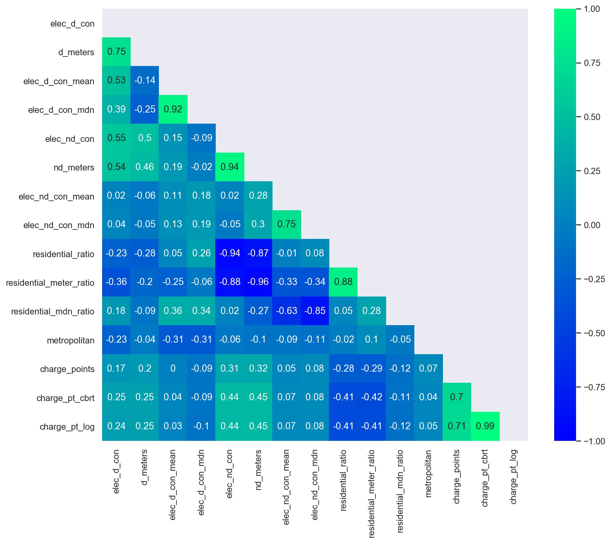

# Exploratory Data Analysis (EDA) - Feature Variables

###### Predicting Electric Vehicle Charge points locations in Britain

------

## Definitions

**EV charge point/charging unit** – a single upstand or wall-mounted structure offering one or more socket outlets or tethered plugs suitable for charging EVs.

**EV charging station** – a physical site with at least one charge point installed suitable for charging at least two EVs. A station usually (but not always) has other physical structures accompanying the charge point(s) such as an energy supply enclosure (feeder pillar), weather shelter, signage, protection barriers for the equipment.

**Middle Layer Super Output Area (MSOA)** - A government tracked area that has a minimum population size of 5,000 and a maximum population size of 15,000

| **Geography** | **Minimum population** | **Maximum population** | **Minimum number of households** | **Maximum number of households** |
| ------------- | ---------------------- | ---------------------- | -------------------------------- | -------------------------------- |
| LSOA          | 1,000                  | 3,000                  | 400                              | 1,200                            |
| MSOA          | 5,000                  | 15,000                 | 2,000                            | 6,000                            |

---------

### Distributions

It was found that most variables (features and target included) had skewed distributions. The distribution of feature variables are mostly positively skewed with only 4.1% being normally distributed; Significant outliers in the variables exist

The variables that had *normal distributions* in the data across all MSOAs were:

***Socio-Economic*** 

| **variable**        | **description**                                              |
| :------------------ | :----------------------------------------------------------- |
| `chanyp_score`      | the lack of attainment and skills in the local population relating to children and young people |
| `adultskills_score` | the lack of attainment and skills in the local population relating to adult skills |
| `widerbar_score`    | barriers to housing and local services based on affordability |
| `geo_bar_scor`      | barriers to housing and local services based on physical proximity of local services |
| `indoor_score`      | the quality of the local environment based on quality of housing (indoors) |
| `outdoor_score`     | the quality of the local environment based on  air quality and road traffic accidents (outdoors) |
| `heatlh_score`      | the risk of premature death and the impairment of quality of life through poor physical or mental health |
| `crime_score`       | the risk of personal and material victimisation at local level |

<table>
    <tr>
        <td>
            
        </td>
        <td>
            
        </td>
    </tr>
</table>

________________________________
***Transport & Car related*** 

| **variable**             | **description**                                              |
| :----------------------- | :----------------------------------------------------------- |
| `cardriver_from_friends` | average weekday number of journeys done by driving from visit friends (home-based) |
| `two_car`                | number of people who own 2 cars in the MSOA                  |
| `total_cars`             | total number of cars in the MSOA                             |

<table>
    <tr>
        <td>
            
        </td>
        <td>
            
        </td>
    </tr>
</table>

------

### Transformations
In order to address some of the outliers the data was transformed. This included logarithmic and power transformations (Box-Cox or Yeo-Johnson) to aggregation with final standardisation.

***Socio-Economic*** 

<table>
    <tr>
        <td>
            
         </td>
    </tr>
</table>

***Population & Income*** 
<table>
    <tr>
        <td>
            
        </td>
    </tr>
</table>

***Transportation*** 

<table>
    <tr>
        <td>
            
        </td>
    </tr>
</table>

***Electricity*** 
<table>
    <tr>
        <td>
            
        </td>
    </tr>
</table>

### Correlations

Large numbers of EV charge points in an area may occur where there is higher weekday number of journeys:

1. to employers business regardless of transportation mode in the respective area
2. to recreational events regardless of transportation mode in the respective area
3. to work by walking, cycling, driving or bus in the respective area
4. by rail to shopping in the respective area

<table>
    <tr>
        <td>
            
        </td>
        <td>
            
        </td>
        <td>
            
        </td>
    </tr>
    <tr>
        <td>
            
        </td>
        <td>
            
        </td>
        <td>
            
        </td>
    </tr>
</table>

Large numbers of EV charge points in an area may occur where there is:

1. high 2018 non-domestic electricity consumption in the respective area
2. high number of non-domestic electricity meters in the respective area

The majority of the indicators in the Indices of Deprivation are measured as proportions or rates of the population that are deprived, and therefore use denominators based on population

[Click here for the EDA 2 notebook code](/notebooks/2.0-ced-exploratory-data-analysis.ipynb)

|                                                              |                                                              |                        |
| ------------------------------------------------------------ | ------------------------------------------------------------ | ---------------------- |
| <a href="business_problem.md#the-business-problem">The Business Problem</a> | <a href="eda1.md#eda">Exploratory Data Analysis (EDA) - Target Variable</a> <a href="eda2.md#eda">Exploratory Data Analysis (EDA) - Feature Variables</a> | Analysis               |
| <a href="data.md#data--methodology">Data & Methodology</a>   | Modelling & Evaluation                                       | Findings & Conclusions |

[Back to Beginning](https://github.com/cdenbowjr/ev_chargepoint_prediction#predicting-electric-vehicle-charge-points-locations-in-britain)
