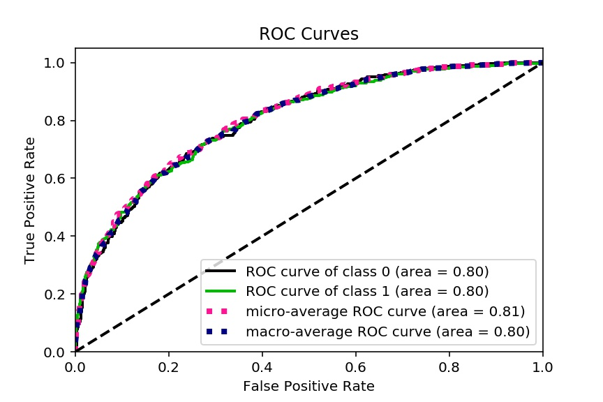
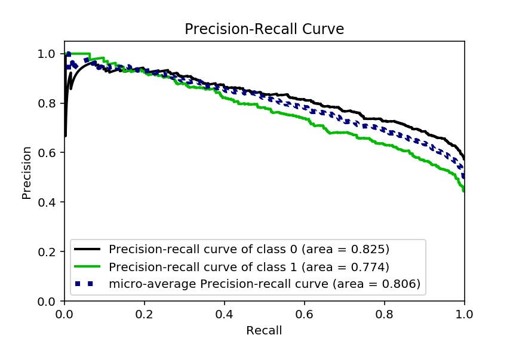

# Modelling & Evaluation

The baseline prediction is about **0.55** which represents the proportion of MSOAs that had a charge point in its vicinity across England.

Below in the table are the scores from the modelling that was conducted

| Model                   | Training | Testing | Cross_Val (Default) | Cross_Val (Tuned) | ROC AUC** (class 1) | PR  AUC* (class 1) | Computational Time (s) |
| ----------------------- | -------- | ------- | ------------------- | ----------------- | ------------------- | ------------------ | ---------------------- |
| Logistic Regression     | 0.733    | 0.725   | 0.714               | 0.718             | 0.8                 | 0.774              | 3.03                   |
| Linear SVM              | 0.734    | 0.720   | 0.715               | 0.717             | --                  | --                 | 9.17                   |
| Neural Network          | 0.803    | 0.717   | 0.671               | 0.716             | 0.76                | 0.722              | 24.4                   |
| Random Forest           | 0.929    | 0.709   | 0.713               | 0.715             | 0.79                | 0.765              | 60.75                  |
| Radial Based SVM        | 0.777    | 0.723   | 0.712               | 0.715             | --                  | --                 | 25.3                   |
| Gradient Boost Ensemble | 0.746    | 0.720   | 0.712               | 0.712             | 0.8                 | 0.765              | 44.7                   |
| Decision Tree           | 0.682    | 0.685   | 0.675               | 0.687             | 0.75                | 0.7                | 0.556                  |
| Gaussian Naive Bayes    | 0.686    | 0.692   | 0.686               | 0.686             | 0.75                | 0.724              | 0.224                  |
| K Nearest Neighbours    | 0.781    | 0.684   | 0.670               | 0.682             | 0.75                | 0.68               | 17.7                   |

\**ROC AUC - Receiver Operating Curve - Area under Curve

\*PR AUC - Precision-Recall - Area under Curve

____

**Logistic Regression model** was the best performing model due to the following:

1. Best tuned cross validation accuracy score (0.718)
2. Largest area under the curve for both the ROC and Precision-Recall curves (0.8 and 0.774)
3. 3rd smallest computational time (3.03 seconds)

Below are the results:

<table>
    <col width="65%">
  	<col width="35%">
    <tr>
        <td rowspan="2"></td>
        <td></td>
    </tr>
    <tr>
        <td></td>
    </tr>
</table>

### The Code

[Click here for the Python Code](/notebooks/3.0-ced-modelling.ipynb)

### Navigator

<table>
    <th align='left'>Previous</th>
    <th align='right'>Next</th>
    <tr>
    	<td align='left'><a href="eda2.md"><< Exploratory Data Analysis II</a></td>
    	<td align='right'><a href="analysis.md">Statistical Analysis >></a></td>
    </tr>
</table>

[Back to Beginning](https://github.com/cdenbowjr/ev_chargepoint_prediction#predicting-electric-vehicle-charge-points-locations-in-britain)

