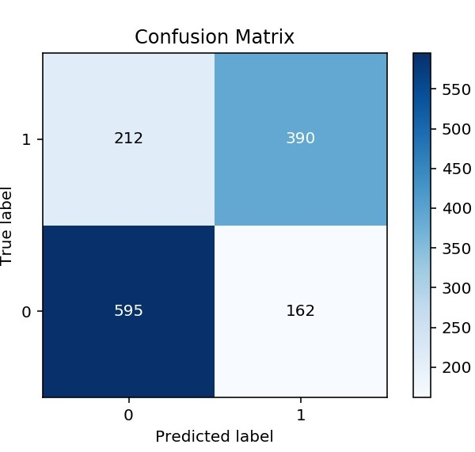

# Modelling & Evaluation

<table>
    <col width="55%">
  	<col width="45%">
    <tr>
        <td rowspan="2"></td>
        <td></td>
    </tr>
    <tr>
        <td></td>
    </tr>
</table>

### The Code

[Click here for the Python Code](/notebooks/3.0-ced-modelling.ipynb)

### Navigator

<table>
    <th align='left'>Previous</th>
    <th align='right'>Next</th>
    <tr>
    	<td align='left'><a href="eda2.md#eda"><< Exploratory Data Analysis II</a></td>
    	<td align='right'><a href="analysis.md#eda">Analysis >></a></td>
    </tr>
</table>

